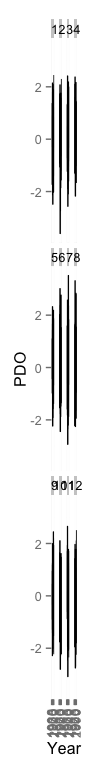

<!-- README.md is generated from README.Rmd. Please edit that file -->
[](https://travis-ci.org/poissonconsulting/rpdo) [](https://cran.r-project.org/package=rpdo) [](https://CRAN.R-project.org/package=rpdo)

rpdo
====

PDO Index
---------

`rpdo` is an R data package of Monthly Pacific Decadal Oscillation (PDO) index values from January 1900 to November 2016.

``` r
library(rpdo)
library(ggplot2)

ggplot(data = subset(rpdo::pdo, pdo$Month == 1), aes(x = Year, y = PDO)) + 
geom_smooth(span = 0.1, se = FALSE, color = "black", method = 'loess') + geom_point() + ylab("January PDO Index")
```



`rpdo` also provides the function `download_pdo()` to scrape the most recent data from the website <http://research.jisao.washington.edu/pdo/PDO.latest>.

Installation
------------

To install and load the most recent release from CRAN

    install.packages("rpdo")
    library(rpdo)

To install and load the development version from GitHub

    devtools::install_github("rpdo")
    library(rpdo)

Information
-----------

The PDO index values are derived as the leading PC of monthly SST anomalies in the North Pacific Ocean, poleward of 20N. The monthly mean global average SST anomalies are removed to separate this pattern of variability from any "global warming" signal that may be present in the data.

For more details, see:

Zhang, Y., J.M. Wallace, D.S. Battisti, 1997: ENSO-like interdecadal variability: 1900-93. J. Climate, 10, 1004-1020.

Mantua, N.J. and S.R. Hare, Y. Zhang, J.M. Wallace, and R.C. Francis,1997: A Pacific interdecadal climate oscillation with impacts on salmon production. Bulletin of the American Meteorological Society, 78, pp. 1069-1079.

Data sources for this index are: UKMO Historical SST data set for 1900-81; Reynold's Optimally Interpolated SST (V1) for January 1982-Dec 2001 and OI SST Version 2 (V2) beginning January 2002.
