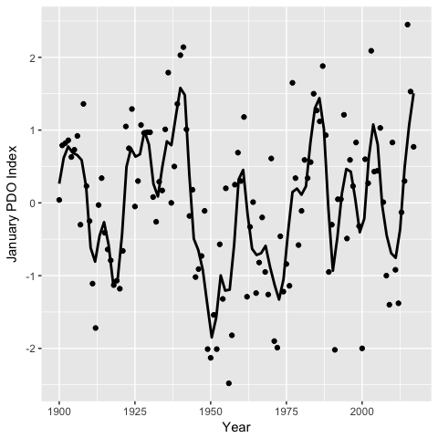

<!-- README.md is generated from README.Rmd. Please edit that file -->
 [](https://travis-ci.org/poissonconsulting/rpdo) [](https://ci.appveyor.com/project/poissonconsulting/rpdo) [](https://codecov.io/github/poissonconsulting/rpdo?branch=master) [](https://cran.r-project.org/package=rpdo) [](https://CRAN.R-project.org/package=rpdo)

rpdo
====

Introduction
------------

`rpdo` is an R data package of Monthly Pacific Decadal Oscillation (PDO) index values from January 1900 to February 2017.

The function `download_pdo()` scrapes the most recent data from <http://research.jisao.washington.edu/pdo/PDO.latest>.

Utilization
-----------

``` r
library(rpdo)
library(ggplot2)

data <- rpdo::pdo

data <- subset(data, data$Month == 1)

ggplot(data = data, aes(x = Year, y = PDO)) + 
geom_smooth(span = 0.1, se = FALSE, color = "black", method = 'loess') + geom_point() + ylab("January PDO Index")
```



Installation
------------

To install the most recent release from CRAN

    install.packages("rpdo")

To install the development version from GitHub

    # install.packages("devtools")
    devtools::install_github("rpdo")

Contribution
------------

Please report any [issues](https://github.com/poissonconsulting/rpdo/issues).

[Pull requests](https://github.com/poissonconsulting/rpdo/pulls) are always welcome.

Please note that this project is released with a [Contributor Code of Conduct](CONDUCT.md). By participating in this project you agree to abide by its terms.

Information
-----------

For more information see <http://research.jisao.washington.edu/pdo/PDO.latest>.
