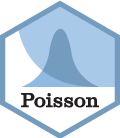

<!-- README.md is generated from README.Rmd. Please edit that file -->

# rpdo 

<!-- badges: start -->

[](https://lifecycle.r-lib.org/articles/stages.html#superseded)
[](https://github.com/poissonconsulting/rpdo/actions/workflows/R-CMD-check.yaml)
[](https://app.codecov.io/gh/poissonconsulting/rpdo)
[](https://creativecommons.org/publicdomain/zero/1.0/)
[](https://cran.r-project.org/package=rpdo)

<!-- badges: end -->

`rpdo` has been superseded by the
[`rsoi`](https://github.com/boshek/rsoi) package which includes the
historical and most recent monthly PDO index values together with
related climate indices.

`rpdo` is an R data package of monthly Pacific Decadal Oscillation (PDO)
index values from January 1900 to September 2018.

The function `pdo_download()` scrapes the data from the no longer
updated <http://research.jisao.washington.edu/pdo/PDO.latest>.

## Demonstration

``` r
library(rpdo)
#> rpdo has been superseded by rsoi
library(ggplot2)

data <- rpdo::pdo

data <- subset(data, data$Month == 1)

ggplot(data = data, aes(x = Year, y = PDO)) +
  geom_smooth(span = 0.1, se = FALSE, color = "black", method = "loess") +
  geom_point() +
  ylab("January PDO Index")
#> `geom_smooth()` using formula = 'y ~ x'
```

<figure>

<figcaption aria-hidden="true">Pacific Decadal Oscillation (PDO) Index
for January by year.</figcaption>
</figure>

## Installation

To install the latest release from [CRAN](https://cran.r-project.org)

``` r
install.packages("rpdo")
```

To install the developmental version from
[GitHub](https://github.com/poissonconsulting/rpdo)

``` r
# install.packages("remotes")
remotes::install_github("poissonconsulting/rpdo")
```

## Information

For more information see
<http://research.jisao.washington.edu/pdo/PDO.latest>.

## Contribution

Please report any
[issues](https://github.com/poissonconsulting/rpdo/issues).

[Pull requests](https://github.com/poissonconsulting/rpdo/pulls) are
always welcome.

## Code of Conduct

Please note that the rpdo project is released with a [Contributor Code
of
Conduct](https://contributor-covenant.org/version/2/0/CODE_OF_CONDUCT.html).
By contributing to this project, you agree to abide by its terms.
